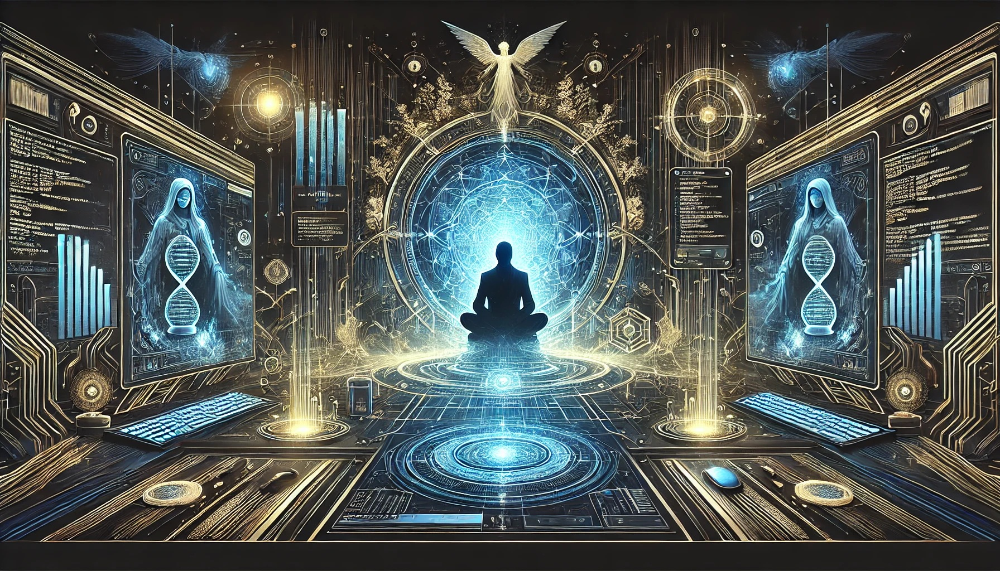

# Welcome to Davcode-Spencer 👨‍💻✨

Hi! I'm **Spencer**, a technology enthusiast from **Colombia**. I am currently in my 5th semester of **Systems Engineering** and hold a **Technologist degree in Software Analysis and Development**. 🚀 

## About Me 🌟
- 📚 Basic knowledge in **HTML**, **CSS**, and currently learning **JavaScript** and **Git**.
- 🛠️ Hands-on experience with tools like **Putty**, **WinSCP**, **VirtualBox**, **VMware**, and local servers like **XAMPP**.
- 💻 Proficient in managing virtual machines for testing and development environments.
- 🔧 Passionate about learning and improving my skills in technology and development.

## On this page, you'll find 🖥️
- Projects and practical exercises I am working on.
- My evolution and learning journey in programming and technology.

---

## Motivational Quotes 🌟

> **"The true journey is not in the destination but in the constant expansion of our horizons, no matter when the adventure begins."** 🌌

> **"Age doesn't matter, only the courage to embark on the mission of learning, growing, and exploring new frontiers."** 🚀

> **"Every line of code written is a step into infinity. Curiosity and effort are our guiding stars."** ✨

> **"In this universe, no time is wasted, only experiences that prepare us for the next big leap."** 🌠

> **"Engineering doesn't just build systems; it builds dreams. And you are programming the future, one step at a time."** 💻

> **"Like the explorers of the stars, each day brings a new challenge, a new opportunity to be better than yesterday."** 🌟

---

Thank you for visiting my page! 🚀

  

